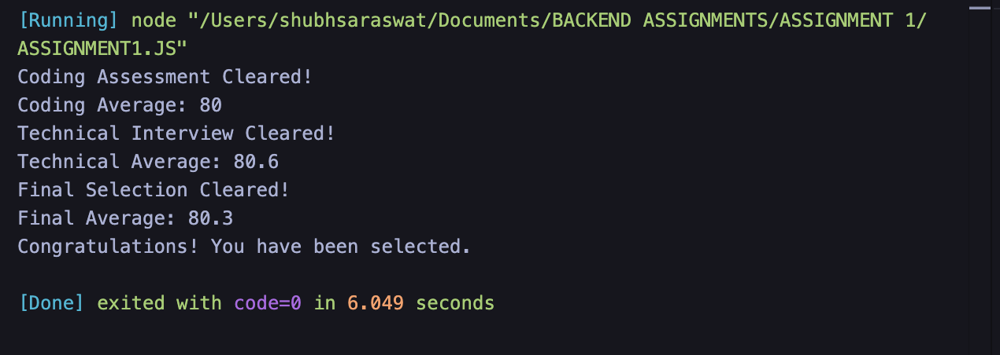

# Assignment 1: Promise-Based Recruitment Evaluation System

## Description

This assignment uses JavaScript Promises to simulate a three-stage recruitment process. A candidate must clear the coding assessment, technical interview, and final selection cutoff.

Each stage runs asynchronously with `setTimeout()`. The stages are connected using Promise chaining, and failures are handled with `.catch()`.

## Recruitment Process

### 1. Coding Assessment

`codingScoreCheck()` calculates the average of the coding marks and checks it against the coding cutoff.

### 2. Technical Interview

`technicalInterviewCheck()` calculates the average of the technical interview marks and checks it against the technical cutoff.

### 3. Final Selection

`finalSelectionCheck()` calculates the average of the coding and technical scores and checks it against the final cutoff.

## Input Data

```js
Coding marks: [80, 75, 90, 85, 70]
Technical marks: [78, 82, 88, 75, 80]

Coding cutoff: 70
Technical cutoff: 70
Final cutoff: 75
```

## Concepts Used

- JavaScript Promises
- Promise chaining with `.then()`
- Error handling with `.catch()`
- Asynchronous execution with `setTimeout()`
- Array iteration and average calculation

## How to Run

From the `assignment_1` directory, run:

```bash
node assignment_one.js
```

## Expected Output

```text
Coding Assessment Cleared!
Coding Average: 80
Technical Interview Cleared!
Technical Average: 80.6
Final Selection Cleared!
Final Average: 80.3
Congratulations! You have been selected.
```


