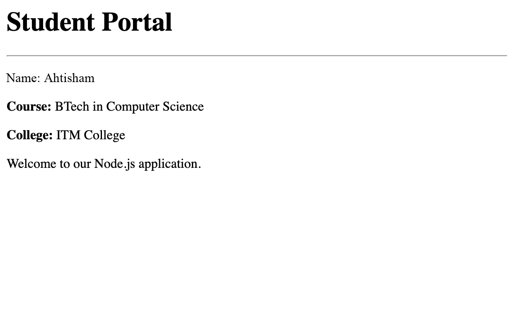

# Assignment 2: Node.js Student Portal

## Description

This assignment creates a basic web server using Node.js and the built-in `http` module. The server responds with an HTML student portal containing student information and a welcome message.

## Folder Structure

```text
assignment_2
└── assignment2.js
```

## Assignment Task

### Create a Student Portal Server

The `assignment2.js` file:

- Imports Node.js's built-in `http` module.
- Creates an HTTP server with `http.createServer()`.
- Sends an HTML response for every request.
- Sets the response content type to `text/html`.
- Displays the student's name, course, college, and a welcome message.
- Listens for requests on port `3000`.

## Student Details

The page displays:

```text
Name: Ahtisham
Course: BTech in Computer Science
College: ITM College
```

## Concepts Used

- Node.js HTTP module
- HTTP server creation
- Request and response objects
- HTTP response headers
- HTML response content
- Server port configuration

## How to Run

From the project root, run:

```bash
node assignment_2/assignment2.js
```

The server will start at:

```text
http://localhost:3000
```

Open this URL in a web browser to view the Student Portal.

## Expected Terminal Output

```text
Server is running on http://localhost:3000
```

## Expected Web Page

The browser displays:

```text
Student Portal

Name: Ahtisham
Course: BTech in Computer Science
College: ITM College

Welcome to our Node.js application.
```


