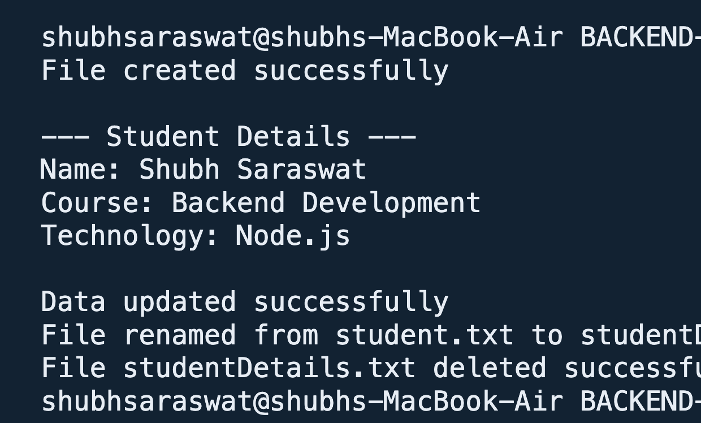

# Assignment 3: Node.js File System Module

## Description

This assignment demonstrates basic file management operations using Node.js's built-in `fs` module. The program creates, reads, updates, renames, and deletes a student details file.

## Tasks Implemented

1. **Create a file:** `fs.writeFile()` creates `student.txt` with student details.
2. **Read a file:** `fs.readFile()` reads and prints the contents of `student.txt`.
3. **Update a file:** `fs.appendFile()` adds experience and city details.
4. **Rename a file:** `fs.rename()` changes the filename to `studentDetails.txt`.
5. **Delete a file:** `fs.unlink()` deletes `studentDetails.txt` after the operations finish.

## File Content

The program initially writes:

```text
Name: Shubh Saraswat
Course: Backend Development
Technology: Node.js
```

It then appends:

```text
Experience: 2 Year
City: mumbai
```

## Concepts Used

- Node.js built-in `fs` module
- Asynchronous file operations
- Callback-based error handling
- File creation and reading
- File updating, renaming, and deletion

## How to Run

From the project root, run:

```bash
cd assignment_3
node index.js
```

## Expected Output

```text
File created successfully

--- Student Details ---
Name: Shubh Saraswat
Course: Backend Development
Technology: Node.js

Data updated successfully
File renamed from student.txt to studentDetails.txt
File studentDetails.txt deleted successfully
```


