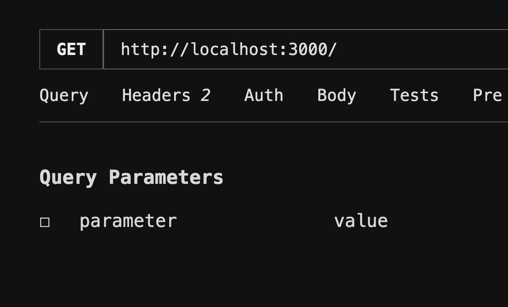
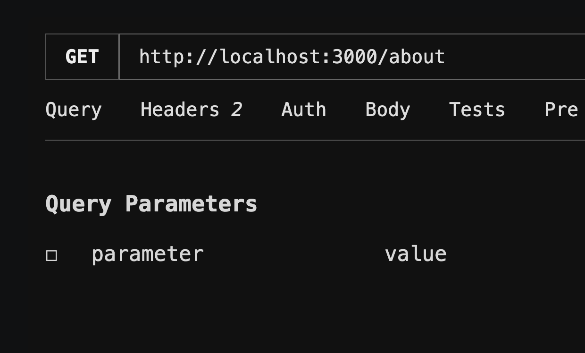
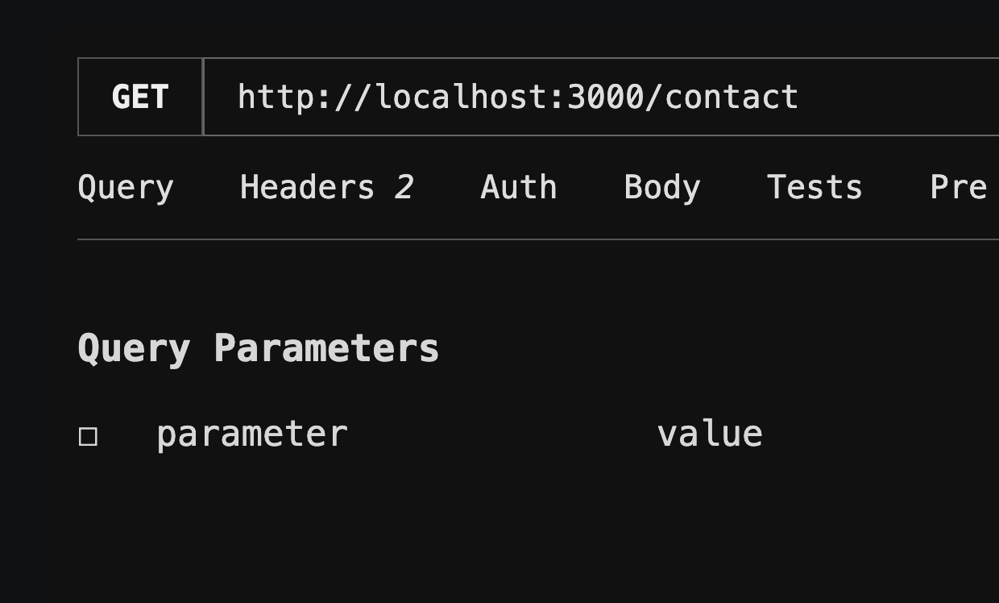
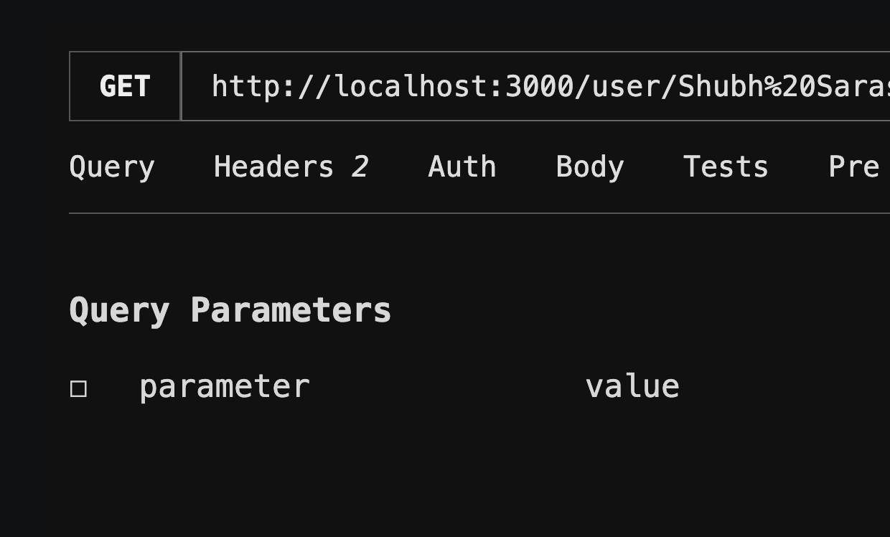

# Assignment 5: Express.js Routes and Middleware

## Description

This assignment creates an Express.js server that demonstrates basic routes, dynamic route parameters, query parameters, and request logging middleware.

## Folder Structure

```text
assignment_5
├── server.js
├── package.json
└── README.md
```

## Tasks Implemented

### Task 1: Basic Routes

| Method | Route | Response |
| --- | --- | --- |
| `GET` | `/` | `Welcome to Home Page` |
| `GET` | `/about` | `This is About Page` |
| `GET` | `/contact` | `This is Contact Page` |







### Task 2: Dynamic Route Parameter

The `/user/:name` route reads a name from `req.params`.

```text
GET /user/john
Hello john
```



### Task 3: Multiple Route Parameters

The `/product/:id/:category` route reads both values from `req.params`.

```text
GET /product/101/electronics
Product ID: 101, Category: electronics
```

### Task 4: Query Parameters

The `/search` route reads optional `name` and `role` values from `req.query`.

```text
GET /search?name=john&role=developer
Name: john, Role: developer
```

The route also handles requests with only `name`, only `role`, or no query parameters.

### Task 5: Request Logging Middleware

The `app.use()` middleware runs before each route and logs the request method and URL using `req.method` and `req.originalUrl`.

## Concepts Used

- Express.js application setup
- GET routes
- Dynamic route parameters with `req.params`
- Query parameters with `req.query`
- Custom middleware
- HTTP request and response handling

## How to Run

From the project root, install the dependency and start the server:

```bash
cd assignment_5
npm install
npm start
```

You can also run it directly:

```bash
node server.js
```

The server runs at:

```text
http://localhost:3000
```

## Routes to Test

```text
http://localhost:3000/
http://localhost:3000/about
http://localhost:3000/contact
http://localhost:3000/user/john
http://localhost:3000/product/101/electronics
http://localhost:3000/search?name=john&role=developer
```

## Expected Console Output

```text
Server is running on http://localhost:3000
GET /
GET /about
GET /contact
GET /user/john
GET /product/101/electronics
GET /search?name=john&role=developer
```
